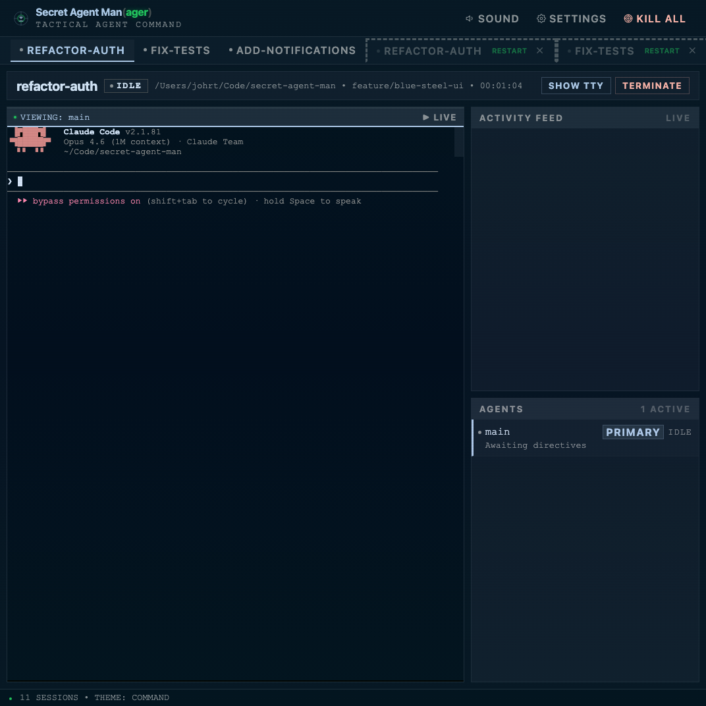

# Secret Agent Man(ager)

Local web dashboard for managing multiple AI coding agent sessions. Monitor what your agents are doing at a glance, get notified when they need you, and jump into any session's terminal without switching windows.

Built with Elixir/Phoenix LiveView, a custom Zig PTY port, and xterm.js. Retro 80s CRT aesthetic.



## Features

- **Multi-session management** -- spawn and monitor multiple Claude Code agents simultaneously
- **Status indicators** -- real-time status dots (working, idle, needs input, done, error) driven by Claude Code hooks
- **Activity feed** -- AI-powered conversation summaries via local Ollama/Gemma 4B (falls back to JSONL extraction)
- **Browser notifications** -- toast overlays + optional audio chime when agents need attention
- **Modal terminal** -- full-screen shell terminal per session for quick commands, git, or neovim
- **Directory picker** -- browse and select workdirs from your project root with MRU quick-picks
- **Session recovery** -- ghost tabs restore previous sessions after SAM restarts
- **Subagent tracking** -- see spawned subagents and their status in the agents panel

## Architecture

Each session runs a supervised process tree:

```
GroupSupervisor (rest_for_one)
  -> Server             (status state machine, PubSub routing)
  -> Summarizer         (Ollama-powered activity summaries)
  -> Parser             (PTY output -> structured events)
  -> TranscriptWatcher  (JSONL transcript -> tool_call/tool_result events)
  -> PTY                (Zig port, raw I/O)
  -> JournalFinder      (fsevents watcher for JSONL file discovery)
```

Status is driven by Claude Code hooks (PreToolUse/PostToolUse) firing HTTP requests to SAM's `/api/hooks` endpoint.

## Prerequisites

- **Elixir** >= 1.15 and **Erlang/OTP** >= 26
- **Zig** >= 0.13 (for the PTY port native binary)
- **Node.js** >= 18 (for asset compilation)
- **Claude Code** CLI installed (`claude` command available)
- **Ollama** (optional, for AI-powered activity summaries) -- [ollama.com](https://ollama.com)

## Installation

```bash
# Clone the repo
git clone https://github.com/jonohrt/secret-agent-man.git
cd secret-agent-man

# Bootstrap everything (checks deps, installs missing ones, builds project)
./bin/setup

# Start the development server
mix phx.server
```

Open [http://localhost:4040](http://localhost:4040) in your browser.

> **Already have Elixir, Zig, and Node installed?** You can skip the bootstrap and run `mix setup` directly.

### Ollama (optional)

For AI-powered activity summaries instead of raw tool names:

```bash
# Install Ollama from https://ollama.com
# SAM auto-pulls the model on first use
ollama serve
```

SAM will automatically download `gemma3:4b` on the first summary request. Without Ollama, the activity feed falls back to showing the agent's own text descriptions.

## Usage

1. Click **DEPLOY AGENT** to create a new session
2. Enter a name, select the working directory, and optionally provide initial directives
3. The agent starts in the embedded terminal -- watch status dots for real-time state
4. Click **SHOW TTY** to open a full-screen shell terminal in the session's workdir
5. Enable **SOUND** for audio notifications when agents need input
6. Use **SETTINGS** to configure your default working directory

### Session Recovery

If SAM restarts, previous sessions appear as ghost tabs (grayed, dashed border). Click to restart with the same name and workdir, or dismiss with the X button.

## Development

```bash
mix test                    # Run tests (66 tests)
mix test --include e2e      # Include E2E browser tests (requires chromedriver)
mix precommit               # Full check: compile --warnings-as-errors, format, test
```

## Tech Stack

- **Backend**: Elixir, Phoenix LiveView, Phoenix Channels, DETS
- **Frontend**: xterm.js, Web Audio API, Browser Notification API
- **PTY**: Custom Zig port for pseudo-terminal management
- **AI**: Ollama + Gemma 4B (local), Claude Code hooks
- **Testing**: ExUnit, Wallaby (E2E)

## License

MIT
